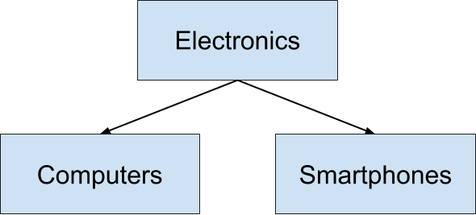

# Advanced OOP

## Inheritance

Inheritence
In our everyday life, we tend to divide things into groups, based on their shared characteristics. Here are some groups that you have probably used yourself: electronics, tools, vehicles, or plants.

Sometimes these groups have hierarchies. For example, computers and smartphones are both types of electronics, but computers and smartphones are also groups in and of themselves. You can imagine a tree with "electronics" at the top, and "computers" and "smartphones" each as children of the "electronics" node.



Object-oriented programming uses the same principles! For instance, imagine a Vehicle class:

```cpp
class Vehicle {
public:
  int wheels = 0;
  string color = "blue";

  void Print() const
  {
    std::cout << "This " << color << " vehicle has " << wheels << " wheels!\n";
  }
};
```

We can derive other classes from Vehicle, such as Car or Bicycle. One advantage is that this saves us from having to re-define all of the common member variables - in this case, wheels and color - in each derived class.

Another benefit is that derived classes, for example Car and Bicycle, can have distinct member variables, such as sunroof or kickstand. Different derived classes will have different member variables:

```cpp
class Car : public Vehicle {
public:
  bool sunroof = false;
};

class Bicycle : public Vehicle {
public:
  bool kickstand = true;
};
```

[Lesson example](./lesson_03_inheritance.cpp)

### Inherited Access Specifiers

Just as access specifiers (i.e. public, protected, and private) define which class members users can access, the same access modifiers also define which class members users of a derived classes can access.

[Public inheritance](https://en.cppreference.com/w/cpp/language/derived_class#Public_inheritance): the public and protected members of the base class listed after the specifier keep their member access in the derived class

[Protected inheritance](https://en.cppreference.com/w/cpp/language/derived_class#Protected_inheritance): the public and protected members of the base class listed after the specifier are protected members of the derived class

[Private inheritance](https://en.cppreference.com/w/cpp/language/derived_class#Private_inheritance): the public and protected members of the base class listed after the specifier are private members of the derived class

[Lesson example](./lesson_04_access_specifiers.cpp)

[Lesson example](./lesson_05_exercise.cpp)

## Composition

Composition is a closely related alternative to inheritance. Composition involves constructing ("composing") classes from other classes, instead of inheriting traits from a parent class.

A common way to distinguish "composition" from "inheritance" is to think about what an object can do, rather than what it is. This is often expressed as "has a" versus "is a".

From the standpoint of composition, a cat "has a" head and "has a" set of paws and "has a" tail.

From the standpoint of inheritance, a cat "is a" mammal.

There is no hard and fast rule about when to prefer composition over inheritance. In general, if a class needs only extend a small amount of functionality beyond what is already offered by another class, it makes sense to inherit from that other class. However, if a class needs to contain functionality from a variety of otherwise unrelated classes, it makes sense to compose the class from those other classes.

[Lesson example](./lesson_06_composition.cpp)